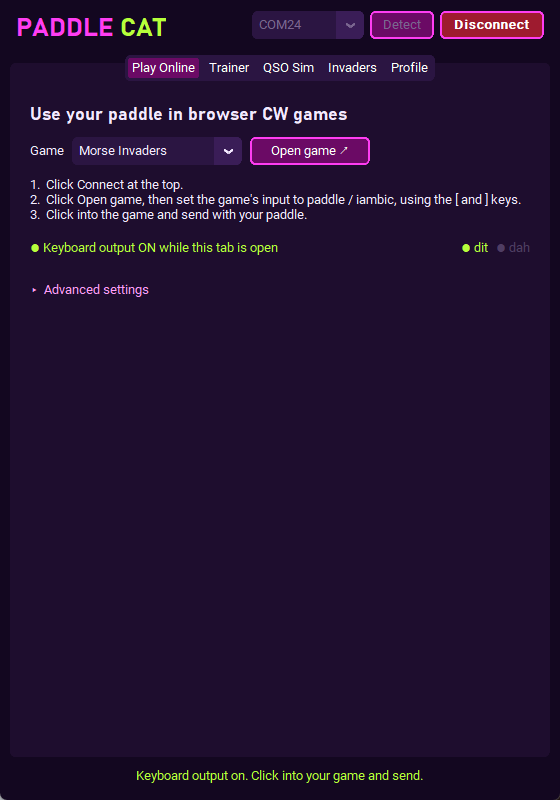
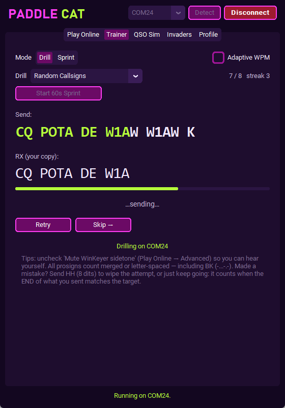
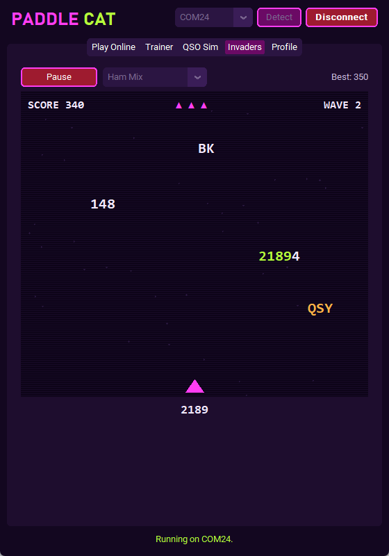

<p align="center">
  
</p>

<h1 align="center">PaddleCAT - WinKeyer CW Trainer</h1>

**Your WinKeyer is now a VBand adapter.** Play
[Morse Invaders](https://morseinvaders.com),
[VBand](https://hamradio.solutions/vband/) and
[Vail](https://vail.woozle.org) with your own paddle, with no extra dongle.

PaddleCAT is a free Windows app for practising Morse code with a **K1EL
WinKeyer** and your paddle. Besides playing browser games, it scores your
sending, runs drills and simulated QSOs, and has its own arcade game.

<p align="center">
  
  
  
</p>
<p align="center"><sub>Play Online &nbsp;·&nbsp; Trainer &nbsp;·&nbsp; PaddleCAT Invaders</sub></p>

> **You need:** a Windows PC and a K1EL **WinKeyer 3** (WK3, or a WKUSB with
> WK3 firmware) with your paddle plugged in. Tested on a K1EL WK3.1.

## Download and install

### [⬇ Download PaddleCAT for Windows](https://github.com/Waffleslop/paddlecat/releases/latest/download/PaddleCAT.exe)

There's nothing to install. It's a single program file.

1. **Click the download link above.** If your browser asks, choose **Keep**.
   Browsers sometimes flag programs they haven't seen before.
2. **Move it somewhere handy** (your Desktop is fine), then **double-click
   `PaddleCAT`** to open it.
3. **The first time only**, Windows may show a blue *"Windows protected your
   PC"* box. This appears because the app is new and from a small independent
   developer, not because anything is wrong. Click **More info**, then
   **Run anyway**. You won't see it again.
4. **Plug in your WinKeyer** and click **Connect** at the top of the app. If
   it can't find the keyer, click **Detect** first.
5. Fill in your callsign and name on the **Profile** tab, then pick a tab and
   start sending.

To update later, download the file again from the same link and replace the
old one. Your profile and high scores are kept.

To remove it, delete the file.

## Play Morse Invaders, VBand and Vail

1. Click **Connect** at the top of PaddleCAT.
2. On the **Play Online** tab, pick your game and click **Open game**.
   PaddleCAT sets the right keys for it.
3. In the game, set the input to **paddle / iambic** (the tab tells you the
   exact setting), click into the game, and send.

Your paddle types into the game only while the **Play Online** tab is open.
Switch to another tab and PaddleCAT pauses keyboard output, so it never types
into the wrong window.

## What's included

**Trainer.** The app shows you a line of CW to send, you send it on your
paddle, and it scores you. It reads the WinKeyer's own decode, so the score
matches what you hear in the sidetone.
- Drill categories: Calling CQ, Contest Exchange, POTA, Rag Chew, Q-Codes &
  Phrases, Common Abbreviations, callsigns, numbers, park IDs, English words.
- Drill mode (lines advance automatically once you send them correctly) and
  Sprint mode (60-second timer with a best score per category).
- Adaptive WPM, a live streak counter, and your measured sending speed.
- Prosigns count whether you send them merged or letter-spaced, including BK.
  Send **HH** (8 dits) to wipe a botched attempt.

**QSO Simulator.** The WinKeyer sends the other station's side through its
sidetone, and you answer on your paddle. Scenarios include short and full rag
chews, POTA hunter and activator, and a contest search-and-pounce QSO.

**PaddleCAT Invaders.** Words, Q-codes, callsigns and numbers fall from the sky, and you
shoot one down by keying it. Seven content mixes, each with its own high score.

**Play Online.** Turns your paddle into keystrokes for browser CW games, with
one-click setup for Morse Invaders, VBand and Vail. Under **Advanced
settings** you can pick your own keys or switch modes:
- *Paddle mode* (the default): the two levers become two keys, and the game
  does the iambic timing.
- *Keyer mode:* PaddleCAT does the iambic timing on one key, with speed set by
  a slider or the WinKeyer's speed knob. Set the game to straight-key input.

**Profile.** Enter your callsign, name, QTH, state, rig and antenna, and the
drills fill them in for you.

## If something isn't working

- **Detect doesn't find the WinKeyer.** Unplug the USB cable, plug it back
  in, wait a few seconds and click **Detect** again. Make sure the keyer is
  plugged directly into the PC, not through an unpowered hub.
- **"Port is in use".** Another program is using the WinKeyer, usually your
  logging or rig-control software. Close that program and click **Detect**
  again. PaddleCAT releases the keyer when you click **Disconnect** or close it, so
  your other programs can use it again.
- **Windows blocked the download or won't open it.** See step 1 and step 3
  above: choose **Keep**, then **More info → Run anyway**.
- **Nothing happens in a browser game.** Keep PaddleCAT on the **Play
  Online** tab, click inside the game window so it's listening for keys, and
  check that the game's input setting matches step 2 on that tab.

Still stuck? [Open an issue](https://github.com/Waffleslop/paddlecat/issues)
and describe what you see.

## Your next steps

- **Drill anywhere:** take your practice to your phone with
  [MorseCAT](https://potacat.com/morsecat), which is built for short CW drills
  whenever you have a spare minute.
- **Get on the air:** once your fist is ready, [POTACAT](https://potacat.com)
  lets you operate your own radio remotely, from anywhere.

PaddleCAT, MorseCAT and POTACAT all come from the same maker.

## For developers

Run from source (Python 3.10+):

```
python -m pip install -r requirements.txt
python winkeyer_app.py
```

Build the standalone `.exe` with `build.bat`. It writes
`dist\PaddleCAT.exe`.

**How it works:** the app puts the WinKeyer into WK3 mode and turns on its
*Paddle Status* report (X2MODE bit 7). The keyer then reports raw lever state
over USB (1200 baud), and the app injects keystrokes through the Windows
`SendInput` API. Scoring uses the WinKeyer's paddle echo, which is decoded in
firmware. An app-side decoder (`morse_decode.py`) adds merged BK, the HH wipe
and a measured-WPM estimate. Sending is comfortable up to about 20–25 WPM.

`winkeyer_vail.py` is also a command-line diagnostic tool:

```
python winkeyer_vail.py detect
python winkeyer_vail.py monitor --port COM3
```

73!
